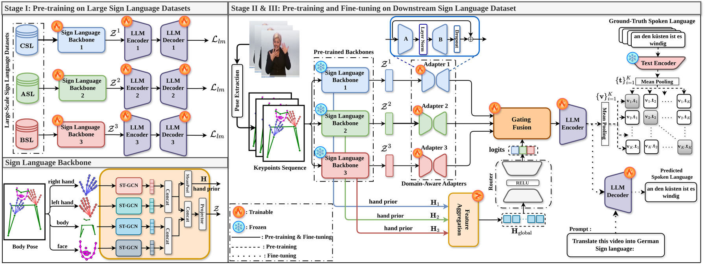

<h2 align="center">SIGNET: Motion-Level Knowledge Transfer for<br/>Cross-Language Sign Language Translation</h2>

<p align="center">
  <a href="https://arxiv.org/abs/2606.28626"></a>
  <a href="LICENSE"></a>
  
</p>

<p align="center"><b>Sobhan Asasi, Ozge Mercanoglu Sincan, Richard Bowden</b><br/>CVSSP, University of Surrey</p>

---

SIGNET reuses **motion-level visual knowledge** across sign languages: an attention-based
**hand-prior aggregation** module guides a **gated fusion network** that dynamically selects
among N pretrained expert backbones, for gloss-free translation that scales across languages.

<p align="center">
  
</p>

## ✨ Highlights
- **Gated mixture-of-experts** over N pretrained experts (`--expert_model_paths`).
- **Hand-prior aggregation** conditions expert routing on hand motion.
- **Gloss-free**; evaluated on How2Sign, Phoenix14T, CSL-Daily, MeineDGS (+ WLASL recognition).

## 🛠️ Installation
```bash
conda create --name signet python=3.9 -y
conda activate signet
pip install -r requirements.txt
```
Sanity check (imports resolve, no GPU/data needed):
```bash
python -c "import sys; sys.path.insert(0,'source'); import gating, gating_contrastive, pre_training, fine_tuning; print('OK')"
```

## 📦 Data Preparation
Set the paths in [`config.py`](source/config.py) (`mt5_path`, `pose_dirs`) and download
[`google/mt5-base`](https://huggingface.co/google/mt5-base). Annotation splits live under
`datasets/<name>/`; extracted pose keypoints are referenced by `pose_dirs`.

## 🔨 Training & Evaluation
Run from the repo root (DeepSpeed). Edit the variables at the top of each script.
```bash
bash pretrain_expert.sh     # Stage I:   pre-train each expert (one per corpus)
bash train_contrastive.sh   # Stage II:  contrastive alignment of the gate
bash train_signet.sh        # Stage III: SLT fine-tuning
bash eval_signet.sh         # Evaluation
```
> Only `CSL_News` ships with a loader. For YT-ASL / BOBSL, add their paths to
> [`config.py`](source/config.py) (they reuse `S2T_Large_Scale_dataset`).

## 🗂️ Code Structure
```
source/
  gating.py              # Stage III: SLT fine-tuning + evaluation
  gating_contrastive.py  # Stage II:  contrastive alignment
  pre_training.py        # Stage I:   from-scratch expert pre-training
  fine_tuning.py         # single-model baseline fine-tuning
  config.py  utils.py    # config + shared helpers
  models/                # SignetModel / SignetExpert / SignetGate + ST-GCN encoder
  data/                  # datasets + collation
  metrics/               # BLEU / ROUGE / WER (+ bundled sacreBLEU/ROUGE)
datasets/                # annotation splits
figs/                    # README figures
*.sh                     # pretrain / contrastive / SLT / eval scripts
```

## 📑 Citation
```bibtex
@inproceedings{asasi2026signet,
  title     = {SIGNET: Motion-Level Knowledge Transfer for Cross-Language Sign Language Translation},
  author    = {Asasi, Sobhan and Mercanoglu Sincan, Ozge and Bowden, Richard},
  booktitle = {European Conference on Computer Vision (ECCV)},
  year      = {2026}
}
```

## 👍 Acknowledgement
The code structure and training scripts follow [Uni-Sign](https://github.com/ZechengLi19/Uni-Sign),
and the sign encoders are inspired by [Geo-Sign](https://github.com/ed-fish/geo-sign).
